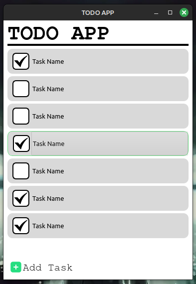
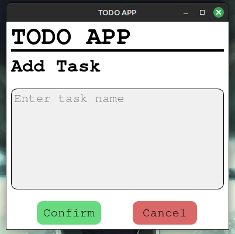

# Simple TODO APP

## Requirements
Use the package manager [pip](https://pip.pypa.io/en/stable/) to install required libraries

```bash
pip install -r requirements.txt
```

## Preview



## Usage
- For now it is a demo with no functionality

### Modules
- [PyQt5](https://doc.qt.io/qtforpython-6/)