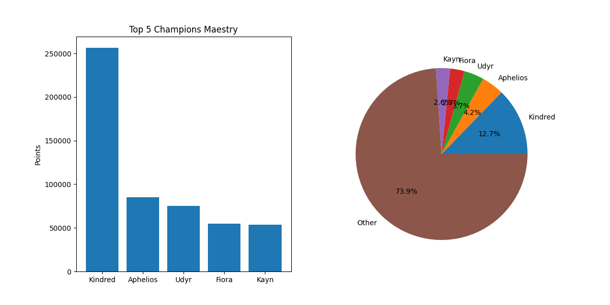

# Top 5 Maestry Points Stats

You need to change API_KEY to your own (https://developer.riotgames.com/)

## Requirements
Use the package manager [pip](https://pip.pypa.io/en/stable/) to install required libraries

```bash
pip install -r requirements.txt
```

## Graphs



### Used
- [requests](https://requests.readthedocs.io/en/latest/)
- [json](https://docs.python.org/3/library/json.html)
- [pandas](https://pandas.pydata.org/)
- [numpy](https://numpy.org/)
- [matplotlib](https://matplotlib.org/)
- [Riot APIs](https://developer.riotgames.com/apis)